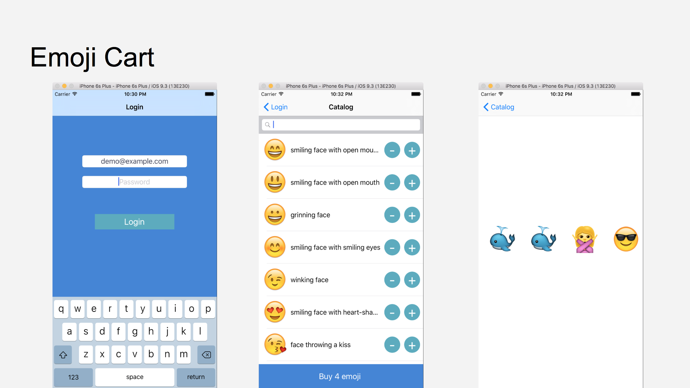

Cart
This is a sample project shown during the 33rd #ebaytechtalk to demonstrate how is possible to run UITests using multiple simulators at the same time.

This example is based on the information available here: [plu/parallel\_ios\_tests](https://github.com/plu/parallel_ios_tests)

